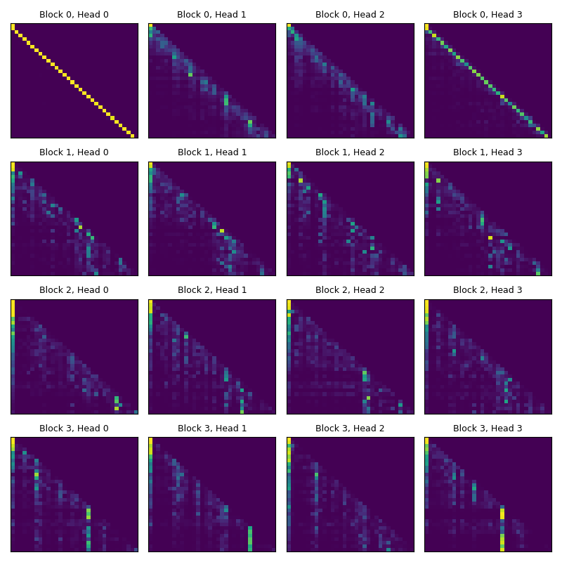
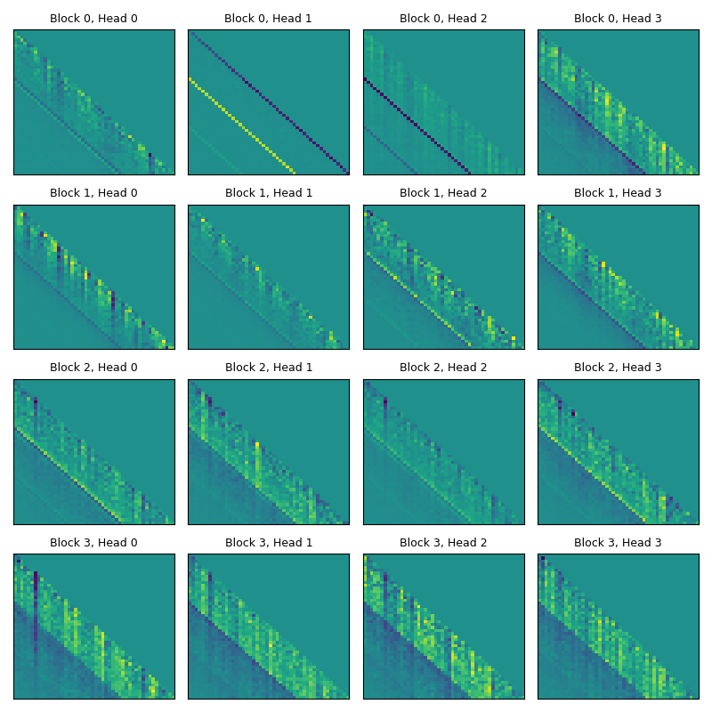
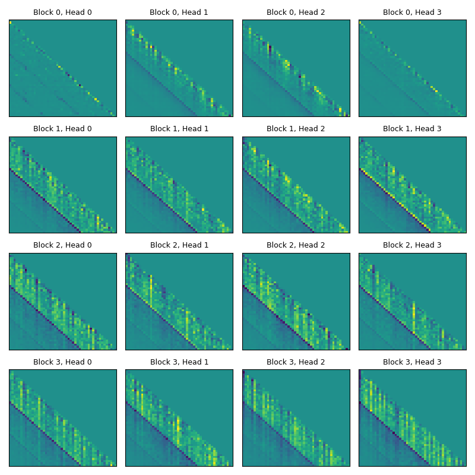
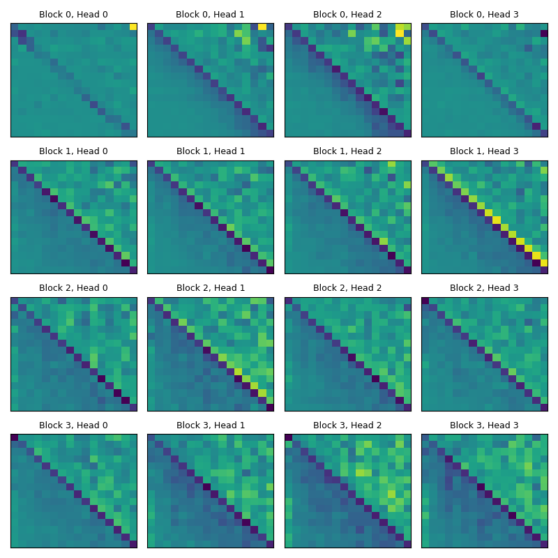
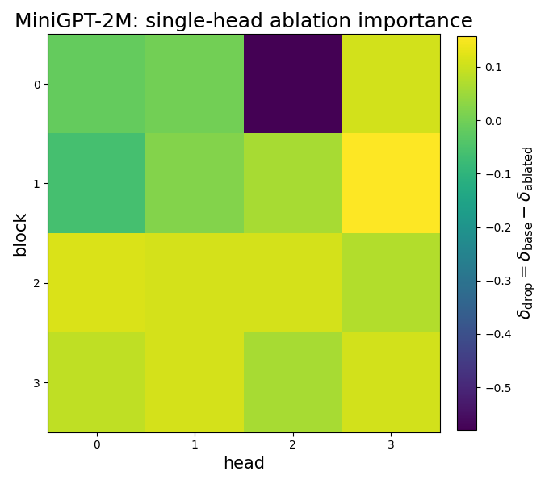
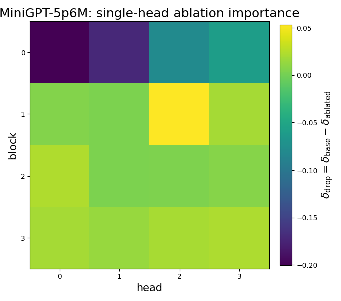

 # MiniGPT 

A small (1-10M parameters) GPT-style language model in **PyTorch** from scratch.
The model is trained on **Project Gutenberg** text (Jane Austen novels), then analyzed with **mechanistic interpretability** tools (attention heatmaps and targeted head ablations) to identify and validate **induction heads**.

---

## Overview

- **Model:** decoder-only GPT-style Transformer (token+pos embeddings, causal multi-head self-attention, MLP blocks, residuals/LayerNorm) implemented from scratch in PyTorch (no `nn.Transformer`).
- **Training:** trained on public-domain Project Gutenberg text (Jane Austen novels).
- **Analysis:** mechanistic interpretability study of **induction heads** using attention heatmaps and targeted head ablations (measuring loss impact).

--- 

## Contents

- `TransformerModel.py` — Causal self-attention (masking), Transformer blocks, and the GPT model definition.
- `MiniGPT.ipynb` —  Data loading + tokenization, training loop, evaluation, and checkpoint saving.
- `InductionHeads.ipynb` — Induction-head investigation: attention heatmaps, head ablations, and quantitative loss/behavior checks.
- `utils.py` — Shared helpers (plotting, ablation utilities, cross-entropy evaluation, etc.).
- `Data/` — Training text (`.txt`) from Project Gutenberg (three Jane Austen novels).
- `Plots/` — Generated attention heatmaps + ablation visualizations for different model sizes.
- `miniGPT_2Mparams.pt` — Example saved checkpoint (model weights + config) for a 2M-parameter run.

---

## Results

### Attention Heatmaps

Below we plot "Attention Heatmaps" for various excerpts from the Jane Austen books. These are shown as 2d plots of cross-token attention; intuitively one can think of it as the degree to which different words "couple" to each other. 

Take a random excerpt from the Jane Austen books: 

" arguments with which you have supported this extraordinary application have been as frivolous as the application was ill - judged . you have widely mistaken my character , if you think i " 

The attention heatmaps of this single excerpt are shown below. 

Notice in all plots, the upper right triangle is 0. This is because attention is causal. In the phrase "the brown dog..", "dog" can attend to "brown", since "brown" comes before "dog" in the sentence. But "brown" cannot attend to "dog", since "dog" comes after.  

Now consider Block 3, Head 3. There is a clear vertical stripe that is brighter than the rest. This corresponds to the token "judged" in the word "ill-judged". The meaning of a bright vertical stripe in this plot is that this token "couples" to the most other tokens in the sentence. This makes sense since "judged" holds weight in the example sentence, since the credibility of the "application" being referred to (which seems to be the main subject of the sentence) sharply changes at that token.  

### Induction-head probe: repeat vs control prompts

To test for induction behavior, we compare two types of prompts:

- **Repeat (r):** `[base, base, base, base]`  
  The same token sequence `base` is repeated multiple times.
- **Control (c):** `[base, rand1, rand2, rand3]`  
  Only the first chunk is `base`; the remaining chunks are unrelated random sequences.

We compute an induction-style attention score **A(r)** on repeat prompts and **A(c)** on control prompts, then plot **A(r) − A(c)**.  
This difference isolates attention that is specifically driven by repeated context (induction-like copying), while controlling for generic attention structure and prompt length.

**How to read the figures**
1) **Attention heatmaps:** look for a bright stripe on the **+1 off-diagonal** in the *zoomed* plots. A stronger stripe indicates more induction-like “copy next token from the previous occurrence” behavior.
2) **Head ablations:** we ablate individual heads at inference time and recompute the induction metric (reported as \(\Delta\)). Heads that cause a large drop in \(\Delta\) are candidates that causally support induction.

---

### Attention patterns (2M vs 5.6M)

<!-- Full attention heatmaps -->
**2M Parameters**: 

**5.6M Parameters**:

<!-- Zoomed attention heatmaps (look for +1 off-diagonal stripe) -->
**2M Parameters (zoomed)**:

**5.6M Parameters (zoomed)**:

---

### Causal tests via head ablations (2M vs 5.6M)

For each model, we ablate individual attention heads at inference time and recompute the induction metric (reported as \(\Delta\)).  
The ablation plots show how \(\Delta\) changes when a head is removed: heads that strongly reduce \(\Delta\) are candidates for induction heads.

